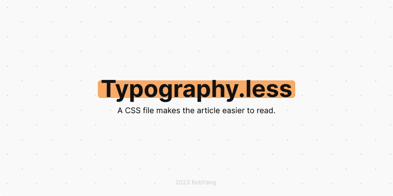

<h1 align="left">Typography.less</h1>

<h4 align="right">A CSS file makes the article easier to read.</h4>

## Use

Download `dist/typo.less.css` and add it to your project, then use:
```
<link href="[Path]/typo.less.css" rel="stylesheet" />
```
to import Typography.less。

## Develop

You need [`Node.js`](https://nodejs.org/), `npm` and `Less`.
If you don't have `Less`, input `npm i -g less` to your terminal.

### Packing

Input `npm run build`, you will get:
```
> typo.less@1.0.0 build
> lessc index.less dist/typo.less.css
```
and the `typo.less.css` is in `/dist`.

### Logo
```JSX
<div
  style={{
    height: '100%',
    width: '100%',
    backgroundImage: 'radial-gradient(circle at 15px 15px, lightgray 2%, transparent 0%), radial-gradient(circle at 45px 45px, lightgray 2%, transparent 0%)',
    backgroundSize: '60px 60px',
    backgroundColor: '#F9F9F9',
    borderRadius: '6px',
    fontFamily: 'Inter, consolas',
    fontSize: '16px',
    fontWeight: 400,
    display: 'flex',
    alignItems: 'center',
    flexDirection: 'column',
    justifyContent: 'center',
    position: 'relative',
  }}
>
  <div 
    style={{
      background: '#f8aa66',
      borderRadius: '6px',
      boxShadow: '0 2px 4px #CCCCCC',
      color: '#121212',
      fontSize: '48px',
      fontWeight: 700,
      lineHeight: 0.75,
      marginBottom: '16px',
      padding: '0 6px',
    }}
  >
  Typography.less
  </div>

  <div>
  A CSS file makes the article easier to read. 
  </div>

  <small style={{
    background: '#F9F9F9',
    color: '#CCCCCC',
    fontSize: '12px',
    position: 'absolute',
    bottom: '5vh',
  }}
  >
    2023 BobYang.
  </small>
</div>
```

###### 2023 [BobYang](https://github.com/wuxian425).